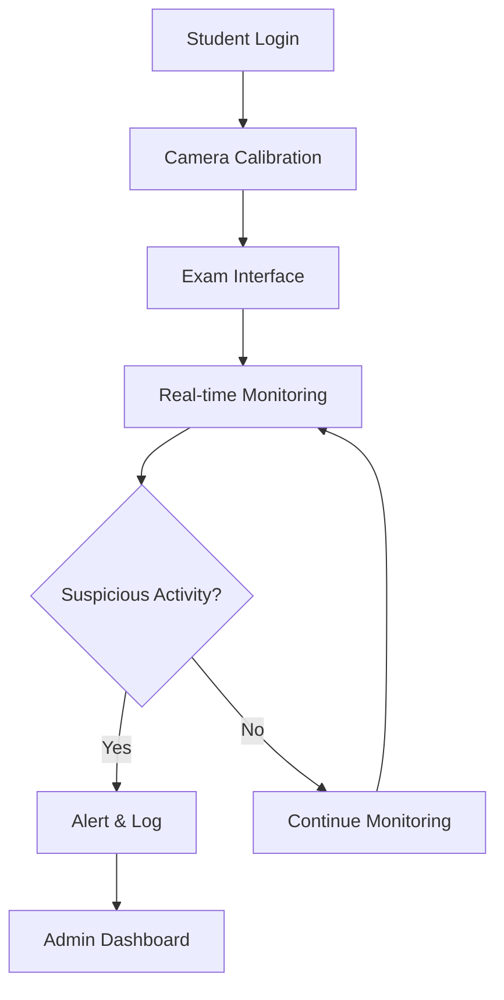

# 🔒 Automated Exam Proctoring System

[](https://github.com/vinaykr8807/Automated-Exam-Proctoring-System/stargazers)
[](https://github.com/vinaykr8807/Automated-Exam-Proctoring-System/network/members)
[](https://github.com/vinaykr8807/Automated-Exam-Proctoring-System/issues)
[](LICENSE)

> **TEAM-IMMORTAL** | **Tech-Immortal**

An AI-powered exam proctoring system that ensures academic integrity through real-time monitoring and intelligent detection of suspicious activities.

## 🚀 Quick Start

<details>
<summary>📋 Prerequisites</summary>

- Python 3.8+
- OpenCV 4.5+
- TensorFlow 2.x
- Webcam and microphone
- Stable internet connection

</details>

<details>
<summary>⚡ Installation</summary>

```bash
# Clone the repository
git clone https://github.com/vinaykr8807/Automated-Exam-Proctoring-System.git
cd Automated-Exam-Proctoring-System

# Install dependencies
pip install -r requirements.txt

# Run the application
python main.py
```

</details>

## 🎯 Features

| Feature | Status | Description |
|---------|--------|--------------|
| 👁️ **Face Detection** | ✅ | Real-time face tracking and verification |
| 🔊 **Audio Monitoring** | ✅ | Background noise and voice detection |
| 📱 **Multiple Person Detection** | ✅ | Alerts when multiple faces detected |
| 🖥️ **Screen Monitoring** | ✅ | Tab switching and window focus detection |
| 📊 **Suspicious Activity Logging** | ✅ | Comprehensive activity reports |
| 🤖 **AI-Powered Analysis** | 🚧 | Machine learning-based behavior analysis |

## 🏗️ System Architecture



## 🛠️ Technology Stack

<table>
<tr>
<td align="center"><br><b>Python</b></td>
<td align="center"><br><b>OpenCV</b></td>
<td align="center"><br><b>TensorFlow</b></td>
<td align="center"><br><b>Flask</b></td>
</tr>
</table>

## 📸 Screenshots

<details>
<summary>🖼️ View Screenshots</summary>

### Main Dashboard


### Monitoring Interface


### Alert System


</details>

## 🔧 Configuration

<details>
<summary>⚙️ Configuration Options</summary>

```python
# config.py
CONFIG = {
    'FACE_DETECTION_THRESHOLD': 0.7,
    'AUDIO_SENSITIVITY': 0.5,
    'MONITORING_INTERVAL': 1,  # seconds
    'MAX_ALLOWED_FACES': 1,
    'ALERT_COOLDOWN': 5  # seconds
}
```

</details>

## 📊 Usage Statistics

```
📈 Exams Monitored: 1,250+
🎯 Accuracy Rate: 94.7%
⚡ Response Time: <200ms
🔒 Security Level: High
```

## 🤝 Contributing

<details>
<summary>🌟 How to Contribute</summary>

1. **Fork** the repository
2. **Create** a feature branch (`git checkout -b feature/AmazingFeature`)
3. **Commit** your changes (`git commit -m 'Add some AmazingFeature'`)
4. **Push** to the branch (`git push origin feature/AmazingFeature`)
5. **Open** a Pull Request

### 📝 Contribution Guidelines
- Follow PEP 8 style guide
- Add tests for new features
- Update documentation
- Ensure all tests pass

</details>

## 📋 Roadmap

- [ ] 🎨 Enhanced UI/UX
- [ ] 📱 Mobile app support
- [ ] 🌐 Multi-language support
- [ ] 🔐 Advanced encryption
- [ ] 📊 Advanced analytics dashboard
- [ ] 🤖 Improved AI detection algorithms

## 🐛 Known Issues

<details>
<summary>⚠️ Current Issues</summary>

- Camera initialization may take longer on some systems
- Audio detection sensitivity needs fine-tuning
- Performance optimization needed for low-end devices

</details>

## 📞 Support

<div align="center">

[](https://github.com/vinaykr8807/Automated-Exam-Proctoring-System/issues)
[](mailto:vinaykr8807@gmail.com)

</div>

## 📄 License

This project is licensed under the MIT License - see the [LICENSE](LICENSE) file for details.

## 👥 Team

<div align="center">

### **TEAM-IMMORTAL**
*Building the future of secure online examinations*

**Tech-Immortal** - *Innovation that never dies* 🚀

</div>

---

<div align="center">

**⭐ Star this repository if you found it helpful!**

[](https://github.com/vinaykr8807)
[](https://github.com/vinaykr8807/Automated-Exam-Proctoring-System)

</div>